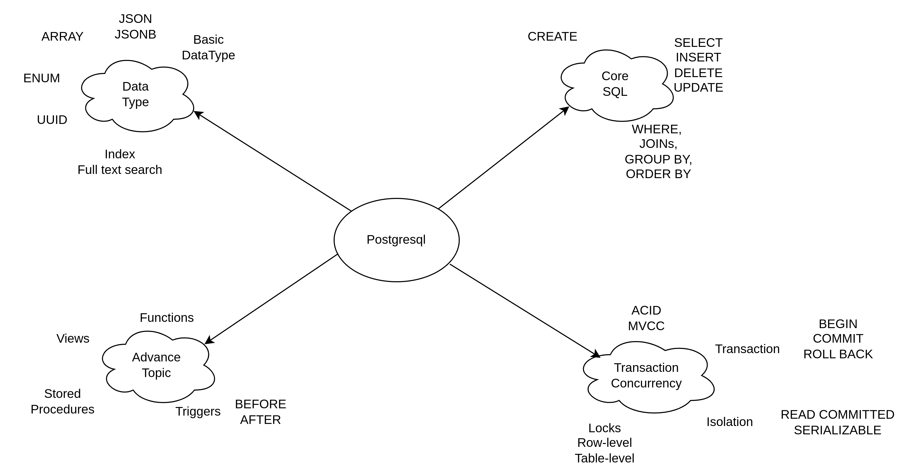
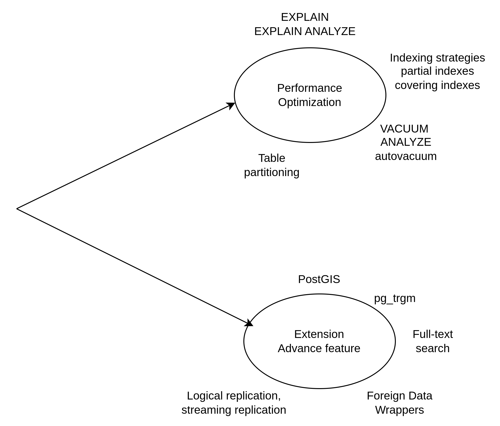
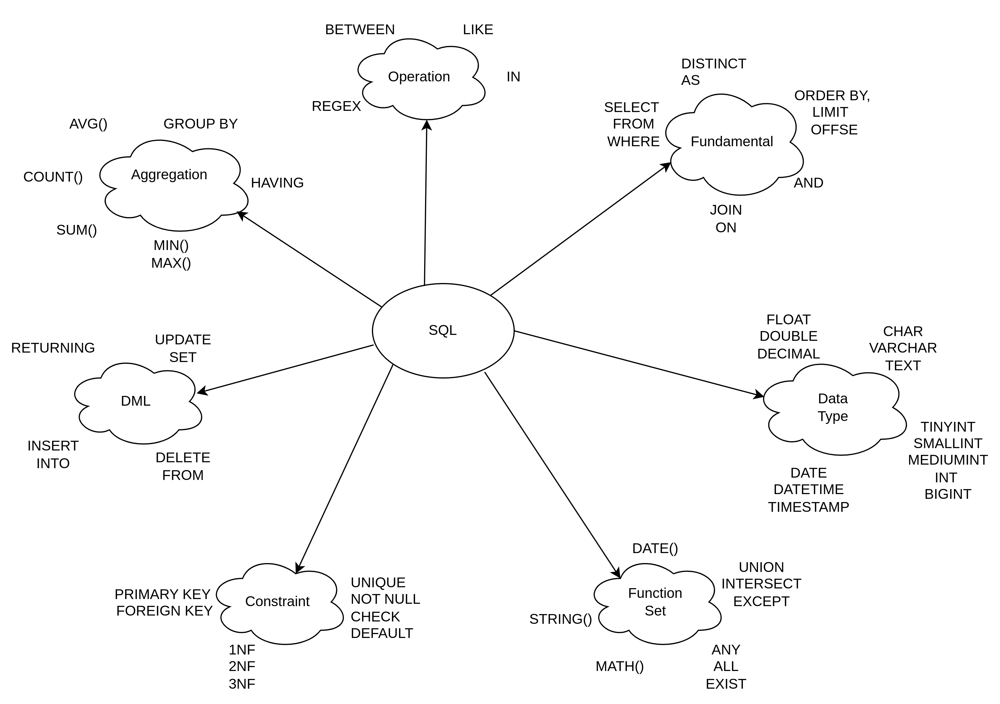

# POSTGRESQL

## BASIC

## ADVANCE

## CORE SQL

## How it work, in view of CS
[InnoDB] 
&emsp;↓ 
os_file_read(page_buf, fd, offset, 16384)   ← gọi hàm này 
&emsp;↓ 
[pread() system call trong Linux] 
&emsp;↓ 
[Kernel Mode: VFS Layer (Virtual File System)] 
&emsp;↓ 
[File System: ext4 / xfs / zfs] 
&emsp;↓ 
[Block Layer & I/O Scheduler] 
&emsp;↓ 
[Device Driver (SSD/HDD)] 
&emsp;↓ 
[Ổ đĩa thật sự đọc dữ liệu từ sector, trả về RAM] 

Database chỉ “ra lệnh”: 
Đọc 16KB ở offset 16384 * 1000 trong file data.ibd 
MySQL nói: “OS ơi, đọc giúp tao 16 KB từ file này tại offset X”. 

